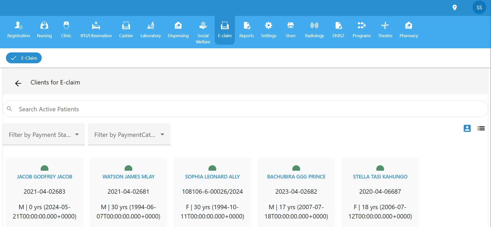

# E-Claim Module

The **E-Claim** module in the healthcare management system facilitates the management and submission of electronic medical claims. This section allows users to view, filter, and manage patient records specifically for the purpose of claim submission.

## Features Overview

### Key Functions
  Filter Options 
  The module provides two types of filters to refine patient listings:

  ####  Filter by Payment Status
  - **All**: Displays all patients regardless of their payment status.
  - **Pending**: Shows patients whose payments are not yet settled.
  - **Paid**: Displays patients who have completed their payments.

  ####  Filter by Payment Category
  - **All**: Includes all patients, regardless of their payment source.
  - **Cash**: Filters for patients who paid out-of-pocket.
  - **Insurance**: Filters for patients covered under insurance plans.

- **Patient List Display**:
  - Patients are shown as cards.
  - Each card includes:
    - Full Name (e.g., `JACOB GODFREY JACOB`)
    - Claim Reference Number (e.g., `2021-04-02683`)
    - Gender and Age
    - Date of Birth

 **Figure 2**: *E-Claim dashboard show  

