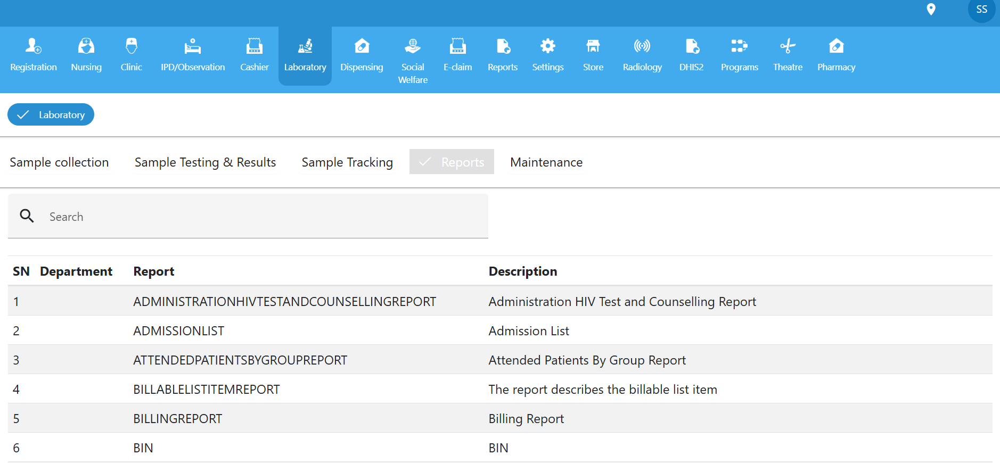
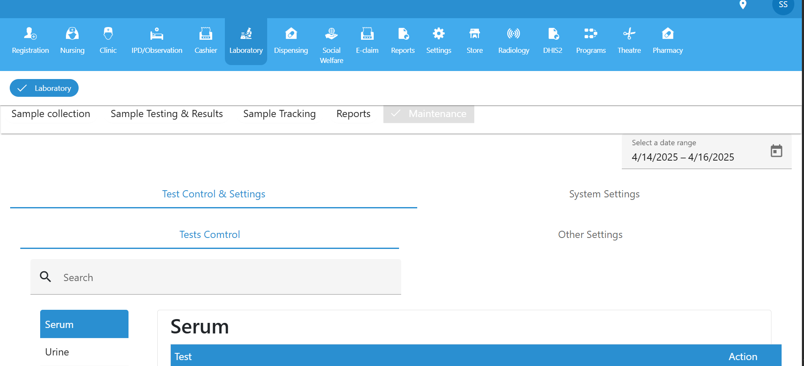

#  Laboratory Module

The **Laboratory** module is a core component of the healthcare management system, designed to streamline the process of sample management—from collection to results reporting. It ensures that laboratory workflows are efficient, traceable, and well-documented.

The Laboratory module includes the following:

### 1.  Sample Collection
This section handles the registration and labeling of specimens collected from patients.

- Assign sample types (e.g., blood, urine, swab).
- Generate barcodes or unique sample IDs.
- Capture collection time and collector details.

 **Figure 2**: *Sample Collection interface*  

### 2.  Sample Testing & Results
Manage the testing of collected samples and input lab results.

- Assign samples to lab technicians.
- Select test types based on physician orders.
- Enter and validate results.
- Mark results as “Preliminary” or “Final”.

 **Figure 3**: *Testing interface showing input fields for results*  

### 3.  Sample Tracking
Track the location and status of samples throughout the testing cycle.

- View real-time status updates (e.g., “Collected”, “In Transit”, “Testing”, “Completed”).
- Audit trail of sample handling and movement.

 **Figure 4**: *Sample tracking dashboard*  

### 4.  Report
Generate and print comprehensive laboratory reports.

- Filter by date, test type, or patient.
- Export as PDF or send to physician modules.
- Include lab comments, interpretation, and reference ranges.

 **Figure 5**: *Sample lab report format*  

### 5.  Maintenance
Used by lab administrators to manage test configurations.

- Add or edit lab tests, panels, and reference ranges.
- Define specimen types and testing procedures.
- Manage lab personnel access levels.

 **Figure 6**: *Maintenance settings page*  

 **Note**: Proper role permissions are required to access Maintenance and Report functionalities.

##  Best Practices

- Always label samples at the point of collection.
- Use the tracking tab to monitor delays or lost specimens.
- Validate results before marking them final to prevent errors.

