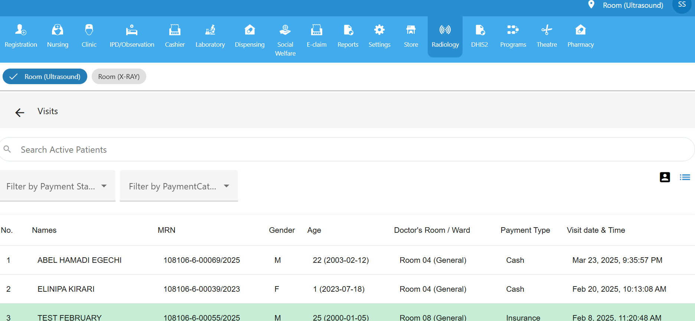

#  Radiology Module

The Radiology module allows healthcare providers to manage imaging services such as **X-Ray** and **Ultrasound**. It helps streamline patient handling, imaging documentation, and workflow organization.

##  Room Types

The Radiology interface includes two selectable room types: **Ultrasound** and **X-Ray**. Users can toggle between these tabs to manage specific imaging queues.

###  Ultrasound Room

The Ultrasound room handles visits for sonographic procedures. When selected:

- Displays a list of patients scheduled for **ultrasound exams**.
- Used by sonographers to manage and document patient scans.
- Ensures efficient queue management for ultrasound services.

###  X-RAY Room

The X-RAY room manages radiographic imaging procedures. When selected:

- Filters and shows only patients scheduled for **X-ray scans**.
- Enables radiology staff to track and manage imaging visits.
- Simplifies access to X-ray imaging history and workflows.

## Search Active Patients

Use the search bar to quickly locate **active patient visits** under each room section. This helps radiology staff handle patient queues more efficiently.

  Tip Switch between **Ultrasound** and **X-Ray** tabs to view corresponding patient lists.

