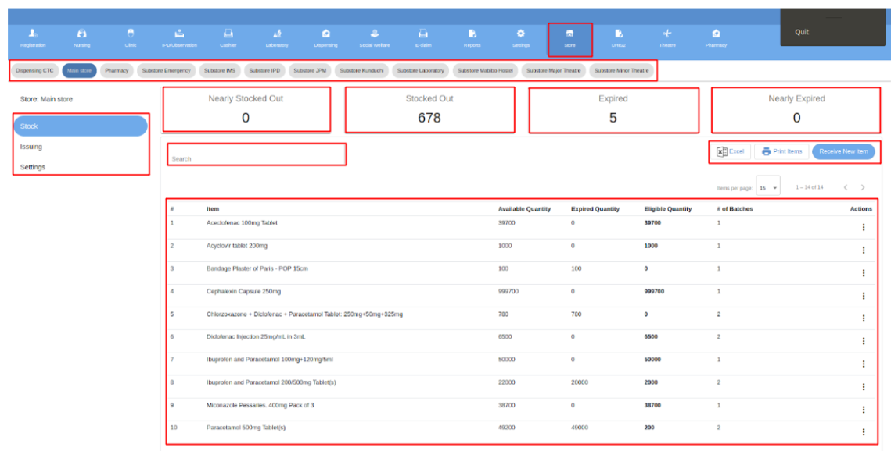

# Store Module

The store module focuses on managing all aspects of a hospital's pharmacy and retail operations. It includes features for dispensing medications to patients, monitoring and replenishing inventory, issuing supplies, receiving incoming stock, and conducting inventory reconciliations. This integrated approach ensures the smooth and efficient operation of the pharmacy and store.  

The store module seamlessly integrates with the hospital's overall workflow and administrative management system, covering both internal and community pharmacy services. The internal pharmacy is closely linked to the clinic and billing modules, while the external or community pharmacy connects with the hospital's inventory and store management system to facilitate the sale of both pharmaceutical and non-pharmaceutical items. Additionally, the community pharmacies interface with the reporting modules to track items sold to the community and generate financial reports.  

The store module also allows users to request and receive a variety of store items, including drugs and consumables, from designated stores and sub-stores. Requesters can easily check the stock status of specific items in both the requested and requested stores. Additionally, the store module can execute dispensing functions when configured to act as a substore for other dispensing units. Pharmacists can also use the module to assess, download, and print information about items in the store that are nearing expiration, have already expired, are running low on stock, or are adequately stocked. This tool empowers pharmacy professionals to efficiently manage pharmaceutical supplies and ensure optimal patient care as seen in Figure 12.  

*Figure 12: Store Module*  
